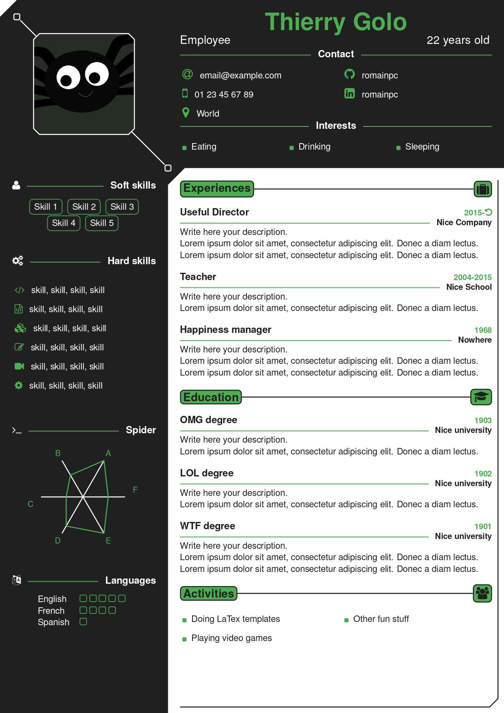
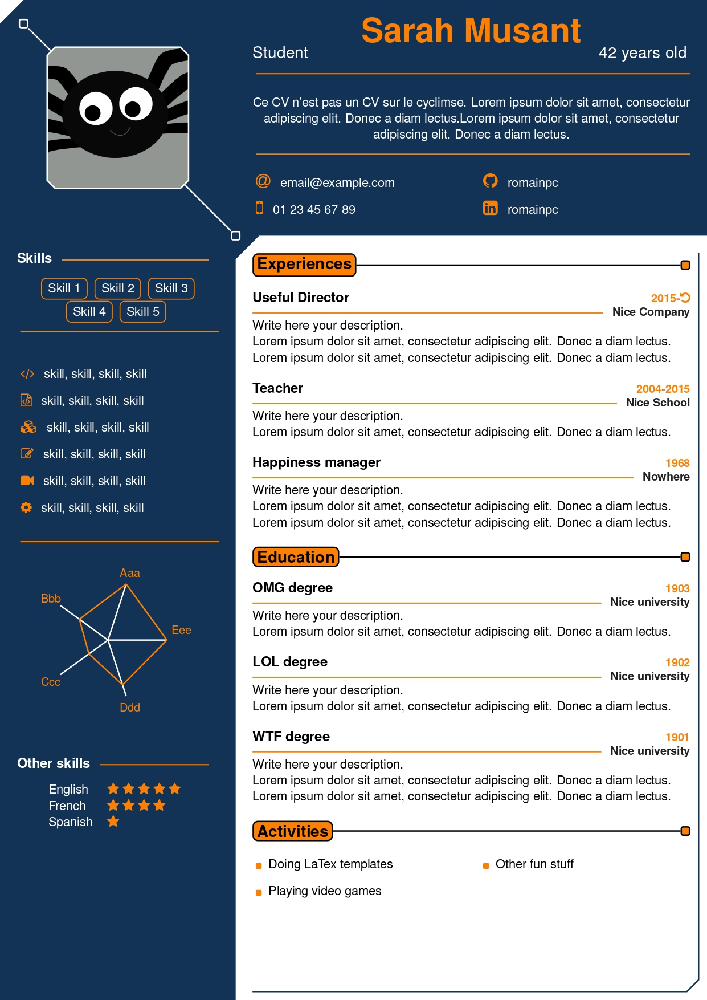
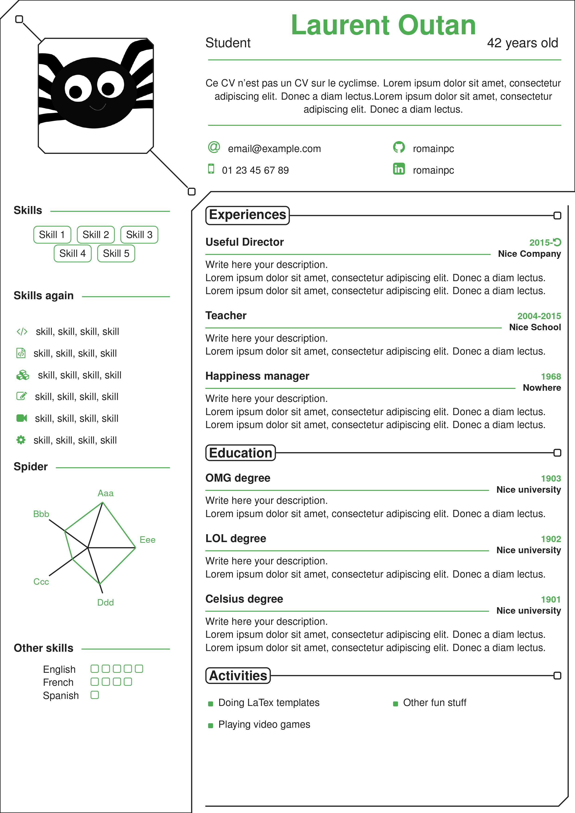

# Spider-CV
LaTex class template for CV/resume.
Called _Spider CV_ because of the spider graph, which I did not find already existing on the internet.

This [class](spidercv.cls) provides all the commands necessary to easily customize your CV.

## Examples

## Documentation
See complete documentation [here](Documentation.md).

## Credits
This template was inspired by the following existing templates :
- [developer-cv](https://www.latextemplates.com/template/developer-cv)
- [developer-cv Doji version](https://fr.overleaf.com/latex/templates/doji-cv-template/qgrgkscqndms)
- [limecv](https://github.com/opieters/limecv)
- [altacv](https://github.com/liantze/AltaCV)